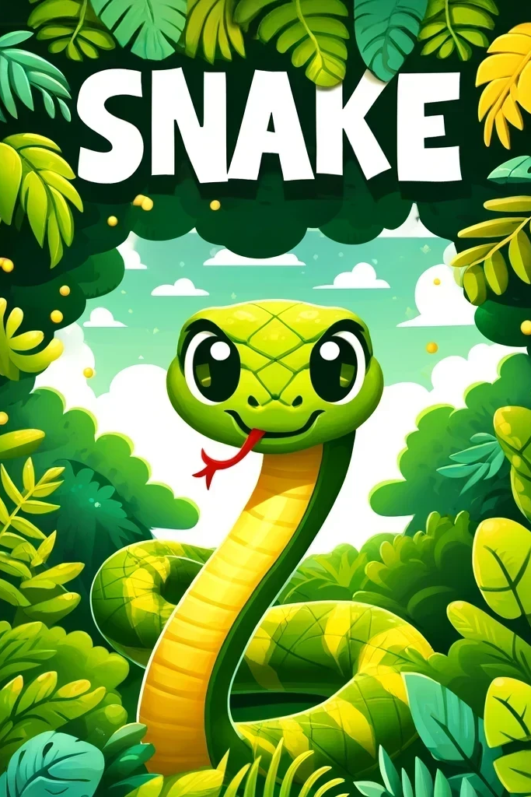
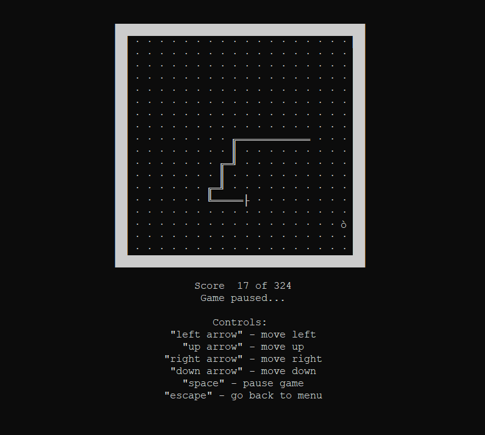
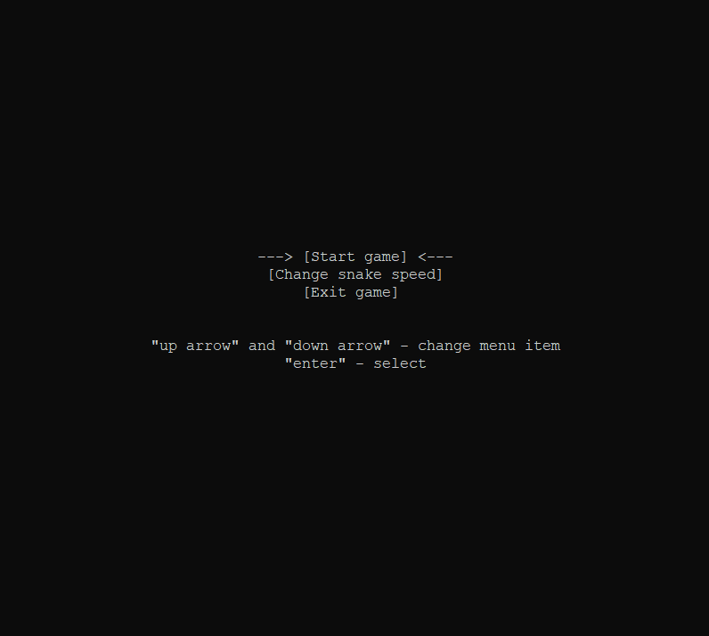
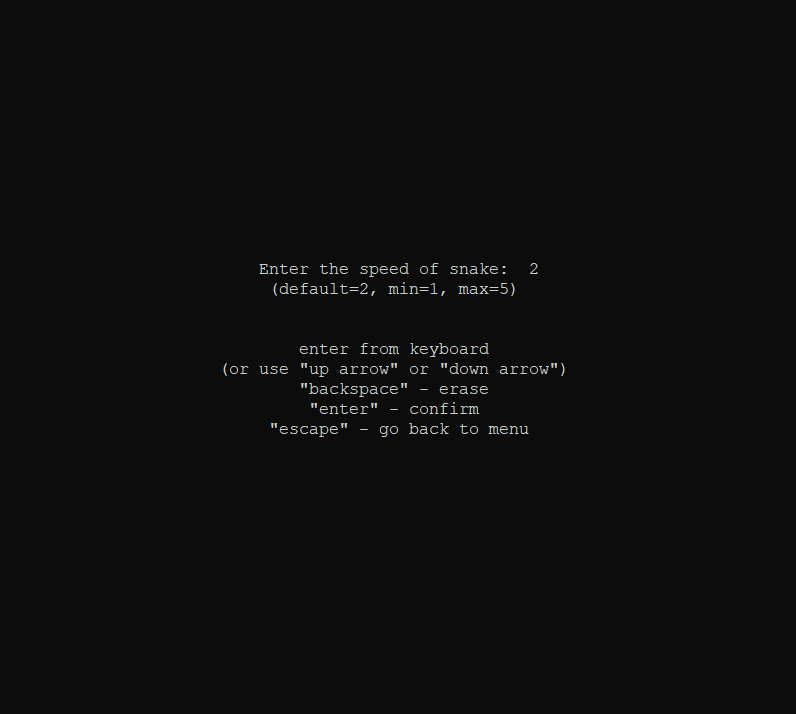

  
  
  
  

 <picture>
   <source srcset="promo/snake_logo.png" width="128px" alt="Snake Game Logo" />
   
 </picture>

<h1 align="center">SnakeGameC</h1>

A console-based snake game for Windows, written in C.

  <picture>
    <source srcset="promo/snake_cover.png" height="539px"/>
    
  </picture>
  <picture>
     <source srcset="promo/snake_screenshot_1.png" height="714px"/>
     
  </picture>
  <picture>
     <source srcset="promo/snake_screenshot_2.png" height="357px"/>
     
  </picture>
  <picture>
     <source srcset="promo/snake_screenshot_3.png" height="357px"/>
     
  </picture>

## Overview

**SnakeGameC** is a simple console snake game built for Windows, developed in C. It was created as part of a university project aimed at teaching students how to work in a team on a modular basis. Each member of the team was responsible for designing and implementing their own module, after which the modules were integrated into a single project.

This approach allowed each team member to work independently, while learning how to combine their efforts to complete the game. The goal was to help students gain experience in team-based software development and modular programming.

## System Requirements to Run `.exe`
- OS: Windows XP or higher

## Build Requirements
To build the executable, you will need:
- **GCC 13.2.0** (Recommended: [MinGW-w64 (UCRT)](https://winlibs.com/))
- **GNU Make** (Recommended: [GnuWin Make](https://gnuwin32.sourceforge.net/packages/make.htm))

### Build Instructions
- Run `make` in the root of the project folder to compile the game.
- Run `make clean` to remove temporary files generated during the build process.

## Developer Information

- **Interface Module Developer**: [**ilvoron**](https://github.com/ilvoron)
- **Controller Module Developer**: [**Fazdo**](https://github.com/Fazdo)
- **Board Module Developer**: [**AlenaBls**](https://github.com/AlenaBls)
- **Snake Module Developer**: [**entyziast**](https://github.com/entyziast)
