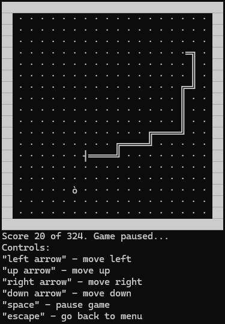

 <picture>
   <source srcset="snake_logo.png" width="128px" alt="Snake Game Logo" />
   
 </picture>

<h1 align="center">SnakeGameC</h1>

Console snake game for windows on C

  <picture>
    <source srcset="snake_cover.png" height="539px"/>
    
  </picture>
  <picture>
     <source srcset="snake_screenshot.png" height="539px"/>
     
  </picture>

## Requirements to run `.exe`
 - OS: Windows XP and higher
## Requirements to build `.exe`
 - GCC 13.2.0 (recommended: [MinGW-w64 (UCRT)](https://winlibs.com/))
 - GNU Make (recommended: [GnuWin Make](https://gnuwin32.sourceforge.net/packages/make.htm))
 - Run `make` in the root project folder
 - Run `make clean` to remove temporary files created during the build process
## Developers' info
- Controller module developer - [**Fazdo**  Reject Stability](https://github.com/Fazdo)
- Interface module developer - [**ilvoron**  Ilya](https://github.com/ilvoron)
- Board module developer- [**AlenaBls**  alnbls](https://github.com/AlenaBls)
- Snake module developer - [**entyziast**  entyziast](https://github.com/entyziast)
